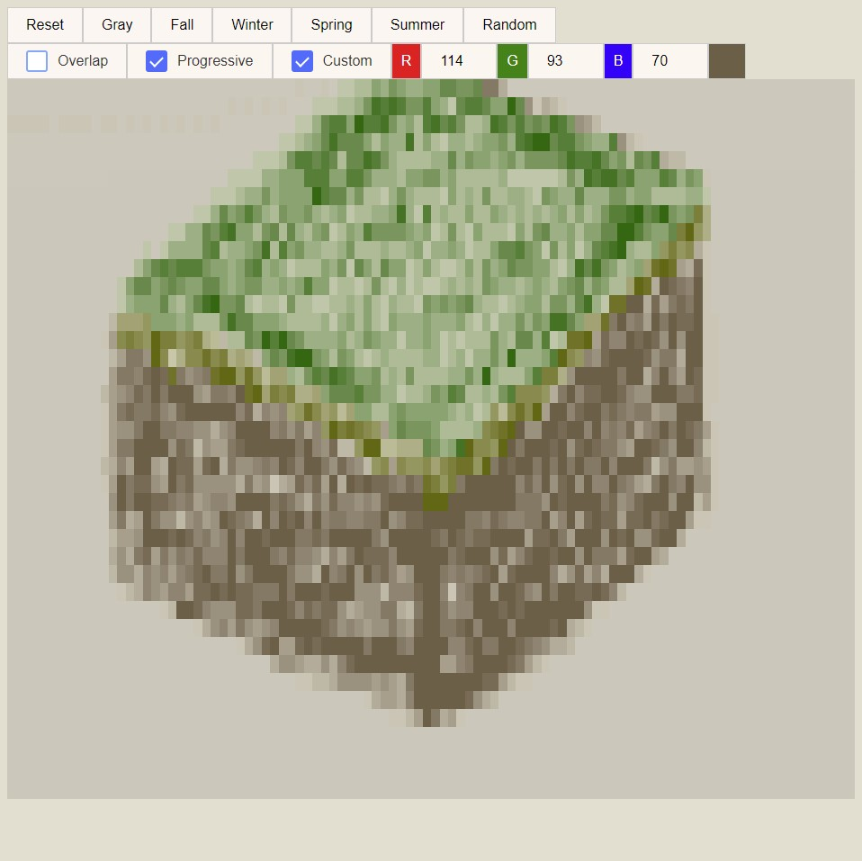
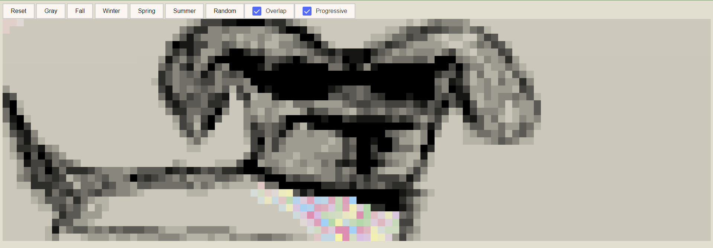
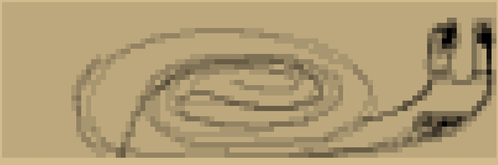

# Etch-a-Sketch
This project is a spin-off on the well-known Etch-a-Sketch. You can try it out here: https://davidrhannah.github.io/etcha-sketch/
## Features

  <ul>
    <li>
        There are a total of 6 color modes: 
        <ul>
          <li>
            Grayscale
          </li>
          <li>
            Fall, Winter, Spring, and Summer themes
          </li>
          <li>
            Random
          </li> 
        </ul>
    </li>
    <li>
      Additional RGB-based color selection mode
      <ul>
        <li>Dynamic visual preview of selected RGB color </li>
      </ul>
    </li>
    <li>
        There are three settings toggles: 
      <ul>
        <li>
            Overlap enables user to override previously colored boxes.
        </li>
        <li>
          Progressive enables darkening upon mouseover.
        </li>
        <li>
          Custom enables user to draw using their color selection.
        </li>
      </ul>  
    </li>
  </ul>

## Program Evolution

  

    <h3>Finished</h3>
    
  

  

    <h3>Midpoint</h3>
    
  

  

    <h3>First Draft</h3>
    
  

